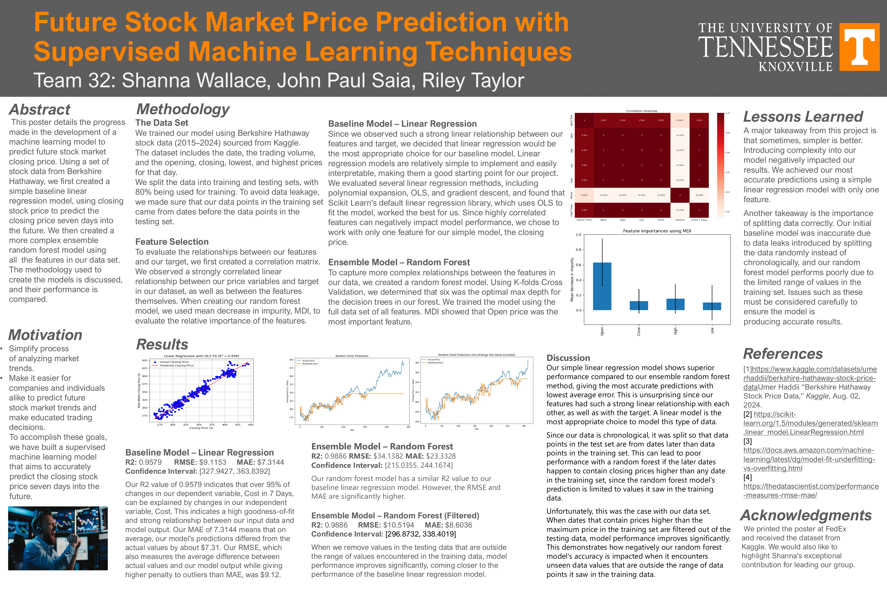

# **Stock Price Prediction Model**
Course Project  
COSC 325 Intro to Machine Learning  
Fall 2024
### Members:
  * John Paul Saia  
  * Riley Taylor  
  * Shanna Wallace  

### Description:
This was a project to create a machine learning model to predict stock closing price 7 days in the future.    
Our methodology and results are outlined in our project poster below.  

### Project Poster:

